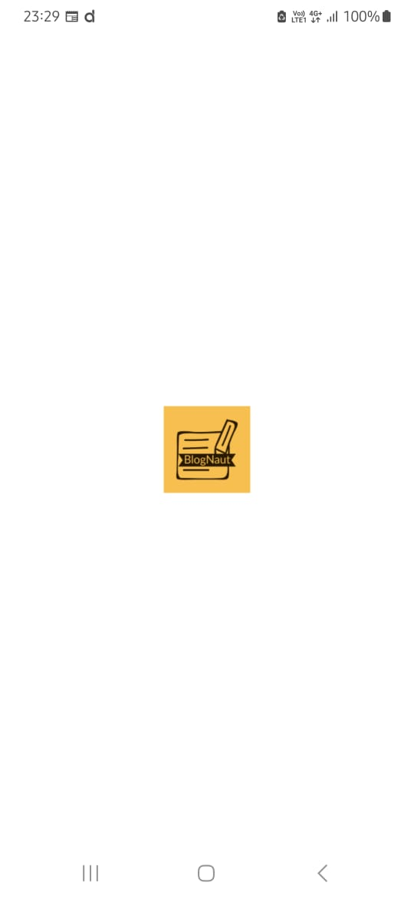
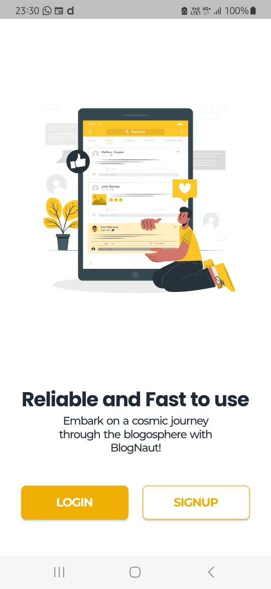
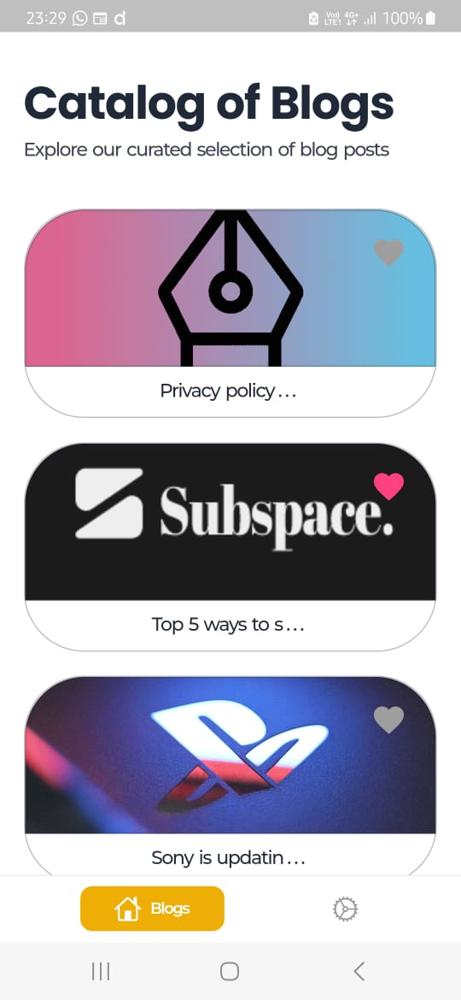
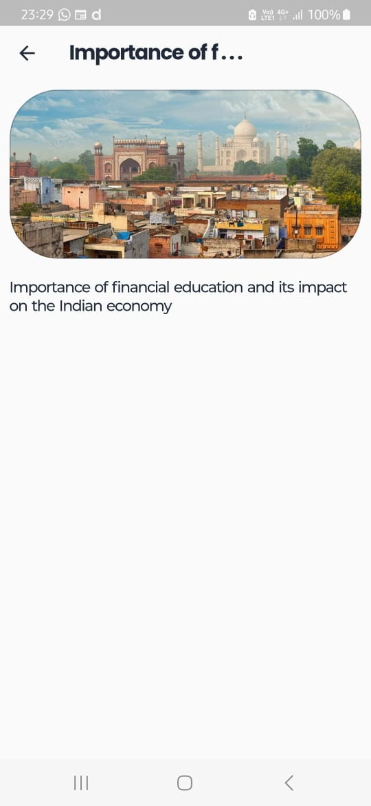
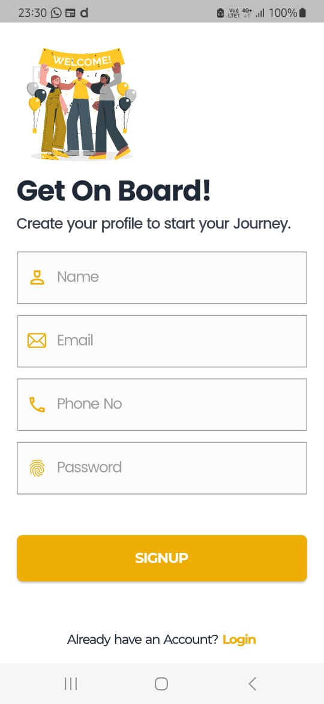
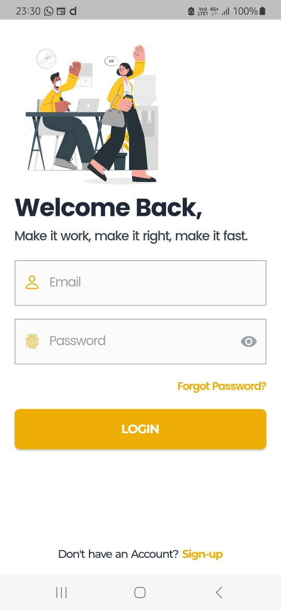
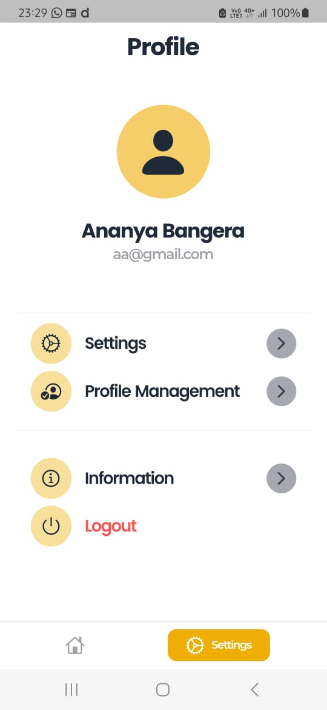

<h1 align="center">
  <a href="https://github.com/ananya-bangera/subspace-assignment-1">
    
  </a>
  <br>
  BlogNaut 📝
</h1>

<div align="center">
  Discover Blogs, Explore Worlds: BlogNaut – Your Cosmic Guide to Content! <br> <br>
  
</div>
<hr>

<details>
<summary>Table of Contents</summary>

- [💭Task](#task)
- [🔗Resources](#resources)
- [🤖Tech-Stack](#tech-stack)
- [📈Progress](#progress)
- [👨‍💻Contributors](#contributors)
- [📱Screenshots](#screenshots)

</details>

## 💭Task
Create an engaging Flutter application called "Blog Explorer" that fetches and displays a list of blogs from a RESTful API and provides users with interactive features to explore and engage with the blogs

## 🔗Resources
- [GitHub Repository](https://github.com/ananya-bangera/subspace-assignment-1)
- [APK File](https://drive.google.com/drive/folders/1xyV0lfRIEGR_BX4bpBFAC2svu-oyw_-u?usp=sharing)
- [Screenshots](https://drive.google.com/drive/folders/1_VFIJAuvyi6NdNTxIwyfWQ8DzSkLVSfV?usp=sharing)

## 🤖Tech-Stack
<a href="https://flutter.dev/" title="Flutter"></a>
<a href="https://dart.dev/" title="Dart"></a>
<a href="https://firebase.google.com/" title="Firebase"></a>
<a href="https://developer.android.com/" title="Android"></a>

## 📈Progress
- [x] API Integration
- [x] Blog List View
- [x] Detailed Blog View
- [x] Navigation
- [x] Interactive Features  
- [x] State Management
- [x] Error Handling  
- [x] UI/UX Design
- [x] Offline Mode

## 🛠Project Setup
1. Clone the GitHub repo
  ```
  git clone https://github.com/ananya-bangera/subspace-assignment-1
  ```
2. Load the project in Android Studio
3. Download all the packages listed in `pubspec.yaml` using `pub get` command
4. Integrate with your Firebase Project by adding your Firebase keys


## 👨‍💻Contributors
- [Ananya Bangera](https://www.linkedin.com/in/ananya-bangera-1647a9207/) - [ananya.bangera100@gmail.com](mailto:ananya.bangera100@gmail.com)


## 📱Screenshots
<p align="middle">
   <br>
<table>
  <tr>
    <td><b>LAUNCHSCREEN </b></td>
     <td><b>HOMESCREEN</b></td>
  </tr>
  <tr>
    <td> </td>
    <td></td>
  </tr>
 </table>
 <br>

<br>
<b></b>
 <br>
    <br>
<table>
  <tr>
    <td><b> BLOG LIST VIEW</b></td>
     <td><b>BLOG VIEW </b></td>
  </tr>
  <tr>
    <td> </td>
    <td></td>
  </tr>
 </table>
 <br>

<br>
<b></b>
 <br>
    <br>
<table>
  <tr>
    <td><b> REGISTER</b></td>
     <td><b>LOGIN </b></td>
  </tr>
  <tr>
    <td></td>
    <td></td>
  </tr>
 </table>
 <br>

<br>
<b></b>
 <br>
 

<table>
  <tr>
     <td><b> PROFILE </b></td>
  </tr>
  <tr>
    <td></td>
  </tr>
 </table>
 <br>

<br>
<b></b>
 <br> 
 

